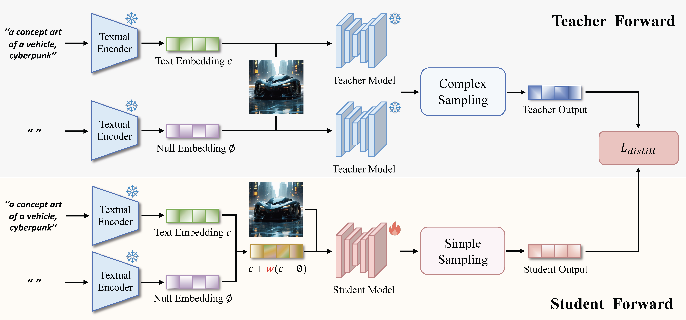

# TeEFusion: Blending Text Embeddings to Distill Classifier-Free Guidance (ICCV 2025)

<p align="center"> 
📝 <a href="https://arxiv.org/abs/2507.18192" target="_blank">Paper</a> • 🤗 <a href="https://huggingface.co/AIDC-AI/TeEFusion" target="_blank">HF Repo</a> 
</p>


TeEFusion is a simple yet powerful distillation method that fuses classifier-free guidance directly into text embeddings, enabling student models to mimic complex teacher sampling strategies with a single forward pass—achieving up to 6× faster inference without sacrificing image quality .


<p align="center">
  
  <br>
  <em>The overview of TeEFusion</em>
</p>

---

## 🚀 Key Features

* **Embed-Level Guidance Fusion**.  
  Incorporates guidance magnitude *w* by linearly combining conditional and null prompt embeddings, eliminating the need for two forward passes .

* **Test-Time Sampling Agnostic**.  
  Distills from complex teacher sampling strategy (Euler + CFG, Z-Sampling + CFG, W2SD + CFG) into a simple student that uses standard Euler sampling .

* **Parameter-Free**.  
  No extra network modules beyond the pretrained model’s encoder and decoder.

---

## 📦 Installation

```bash
git clone https://github.com/AIDC-AI/TeEFusion.git
cd TeEFusion
pip install -r requirements.txt
```

---

## 🛠️ Quick Start

```python
import torch
from pipelines.sd3_teefusion_pipeline import TeEFusionSD3Pipeline

pipe = TeEFusionSD3Pipeline.from_pretrained(
  "AIDC-AI/TeEFusion",
  torch_dtype=torch.bfloat16,
  trust_remote_code=True
)
pipe.to("cuda")


images = pipe(
  prompt=["A serene mountain lake at sunset"],
  num_inference_steps=50,
  guidance_scale=5,
  seed=0
)

for i, img in enumerate(images):
  img.save(f"output_{i}.png")
```

---

## 📚 Citation

If you find TeEFusion helpful, please cite our ICCV 2025 paper:

```bibtex
@inproceedings{fu2025teefusion,
  title={{TeEFusion}: Blending Text Embeddings to Distill Classifier-Free Guidance},
  author={Fu, Minghao and Wang, Guo-Hua and Chen, Xiaohao and Chen, Qing-Guo and Xu, Zhao and Luo, Weihua and Zhang, Kaifu},
  booktitle={the IEEE/CVF International Conference on Computer Vision (ICCV)},
  year={2025}
}
```

## 🙏 Acknowledgments

The code is built upon [Diffusers](https://github.com/huggingface/diffusers) and [Transformers](https://github.com/huggingface/transformers).

## 📄 License

This project is licensed under the Attribution-NonCommercial 4.0 International License (SPDX-License-Identifier: CC-BY-NC-4.0). 

## 🚨 Disclaimer

We used compliance checking algorithms during the training process, to ensure the compliance of the trained model to the best of our ability. Due to complex data and the diversity of language model usage scenarios, we cannot guarantee that the model is completely free of copyright issues or improper content. If you believe anything infringes on your rights or generates improper content, please contact us, and we will promptly address the matter.
